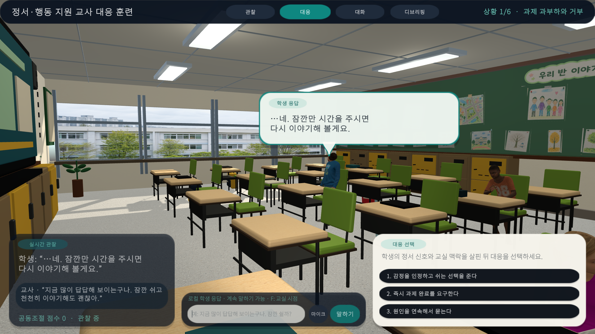
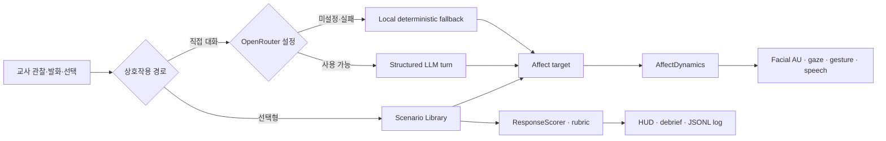
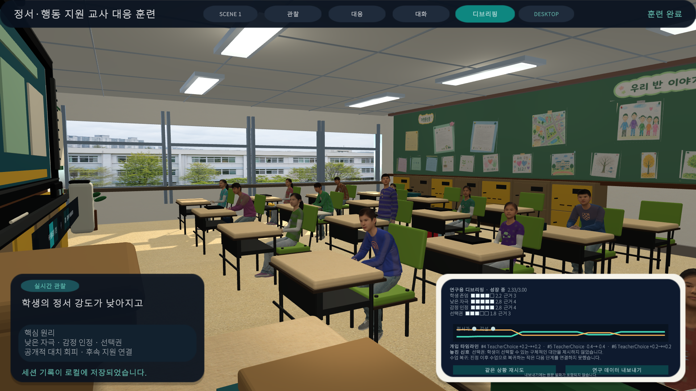

# 한국 교실 AI 교사대응 시뮬레이터

[English README](README.md) | 한국어

한국 초등학교 교실에서 정서·행동 위기 신호를 보이는 학생에게 교사가 안전하고 관계 중심적으로 대응하는 방법을 연습하는 Unity 6 연구 프로토타입입니다. Microsoft Rocketbox 기반 학생 아바타, 한국 교실 환경, 직접 대화, 선택형 대응, 연속적인 정서 변화, 얼굴 Action Unit, 문제행동 제스처, 수행 피드백을 하나의 재현 가능한 시뮬레이션으로 구성했습니다.

> 이 프로젝트는 연구·개발 및 교사교육용 프로토타입입니다. 임상 진단, 실제 학교의 위기 대응 절차, 교원 자격 평가 또는 전문가 판단을 대체하지 않습니다.

| 항목 | 현재 기준 |
|---|---|
| 엔진 | Unity `6000.4.9f1` |
| 대상 플랫폼 | Windows 11, Built-in Render Pipeline |
| 훈련 씬 | 일반 교실 1개, 원형 토론·발표 교실 1개 |
| 학생 NPC | 교실당 15명, Microsoft Rocketbox 기반 |
| 대화 | 로컬 결정론적 fallback + 선택적 OpenRouter 연동 |
| 자동 검증 | EditMode `95/95` 통과, Windows player와 Meta Quest APK build 성공 |
| 프로젝트 상태 | Active research prototype |

## 화면 미리보기

| 한국 초등학교 일반 교실 | 학생 정면 아이컨택 |
|---|---|
|  |  |

| 원형 토론·발표 교실 | 얼굴을 가리지 않는 머리 위 말풍선 |
|---|---|
|  |  |

### 전자칠판 PDF 프레젠테이션

| PDF 1페이지 | 실제 플레이 중 2페이지 전환 |
|---|---|
|  |  |

Windows 플레이어에서 교사가 로컬 PDF를 불러와 이전·다음 페이지 이동과 5초 자동 재생을 사용할 수 있습니다. 현재 페이지 텍스트는 길이를 제한해 학생 응답과 교사 발화 평가 LLM의 수업 맥락으로 전달됩니다. PDF 원본과 렌더 이미지는 로컬에 유지됩니다. 자세한 사용법과 Quest 확장 경계는 [`Docs/PDF_PRESENTATION.md`](Docs/PDF_PRESENTATION.md)를 참고하세요.

## 프로젝트 목표

이 프로토타입은 교사가 학생의 행동만 통제하는 연습이 아니라, 행동 전후의 정서 신호와 교실 맥락을 함께 읽고 공동조절(co-regulation) 중심의 대응을 선택하도록 설계했습니다.

- 학생의 시선, 호흡, 자세, 표정, 손동작에서 초기 위기 신호를 관찰합니다.
- 공개적 압박을 낮추고 학생의 존엄, 안전, 선택권을 보존하는 언어를 연습합니다.
- 안정화 이후 작은 수업 복귀 단계와 비공개 후속 지원을 연결합니다.
- 동일한 교사 발화가 학생의 정서가, 각성, 주도성, 얼굴 근육, 제스처에 어떻게 반영되는지 확인합니다.
- 선택 결과와 훈련 과정을 구조화된 로그로 남겨 후속 학습분석에 사용할 수 있게 합니다.

## 구현된 기능

### 한국 초등학교 교실

- 전자칠판, 전면 수납장, 후면 게시판, 창문, 천장 조명, 벽체, 바닥, 교사용 책상 구현
- 초등학생 비율에 맞춘 책상과 의자, 교실 간격, 이동 동선 구성
- 책상 측면에 걸린 개별 책가방과 앞주머니·옆주머니·상단 패널 디테일
- 한 장의 배경 이미지가 아닌 개별 작품, 통신문, 워크시트, 제목표 에셋 배치
- 지나치게 정렬되지 않은 실제 교실 분위기를 위한 게시물 회전·간격 변형
- ImageGen 기반 벽, 바닥, 책상, 게시물, 창밖 학교 풍경 재질

### 전자칠판 PDF 수업자료 기능

- 실행 중인 Windows 플레이어에서 교사가 로컬 PDF를 선택해 교실의 3D 전자칠판에 직접 표시할 수 있습니다.
- 전자칠판 위의 이전·다음 버튼, 페이지 번호, 5초 자동 재생을 지원합니다. `Ctrl+O`, 방향키, `Page Up`, `Page Down`, `Space` 단축키도 사용할 수 있습니다.
- 페이지를 최대 한 축 2048픽셀로 필요할 때만 렌더링하고 원본 비율을 유지해 표시합니다. 최대 5페이지만 캐시해 전체 문서가 이미지 상태로 메모리에 남지 않게 했습니다.
- 현재 자료의 제목, 페이지 번호, 정리된 본문 텍스트를 학생 응답 생성과 교사 발화 루브릭 평가 프롬프트에 연결할 수 있어 NPC가 현재 수업자료를 맥락으로 대화할 수 있습니다.
- PDF 원본과 페이지 이미지는 로컬에 유지하며, LLM에는 현재 페이지에서 최대 2,400자의 텍스트만 전달합니다.
- 최대 50MB, 80페이지의 PDF를 허용하며 잘못된 형식, 누락 파일, 용량·페이지 초과는 전자칠판 상태 메시지로 안내합니다.
- 기존 버튼 애니메이션과 섬세한 클릭 사운드를 사용하며 데스크톱 포인터와 XR Ray 입력을 모두 지원합니다.
- 로컬 PDF 선택과 렌더링은 현재 Windows에서 제공됩니다. Meta Quest APK에는 Windows PDF 라이브러리가 포함되지 않으며, Quest 직접 불러오기는 Android Storage Access Framework와 ARM64 렌더러 또는 보안 렌더링 프록시가 필요합니다.

### 학생 NPC와 외형 다양성

- Rocketbox child avatar를 Humanoid와 얼굴 blendshape가 유지된 상태로 사용
- 15명의 학생에게 서로 다른 얼굴, 피부톤, 머리색, 헤어 재질, 의상 재질 배정
- 생성형 얼굴 텍스처와 8종 직물 표면, 15종 비문자형 가슴 그래픽 atlas 적용
- 상업 로고와 실제 학교 문장을 사용하지 않는 연령 적합 의상 구성
- 머리와 눈동자가 교사를 추적하되 학생별 확률과 주기를 달리하는 시선 시스템

### 정서, 표정, 몸동작

- 정서가(valence), 각성(arousal), 주도성(dominance)을 연속 값으로 관리
- 한 번의 대화에서 정서가 비현실적으로 급변하지 않도록 변화량 제한과 지수 보간 적용
- 정서 상태와 LLM 지시를 Rocketbox 얼굴 blendshape에 연결하는 Action Unit 제어
- 회피, 안절부절, 철회, 항의, 반항, 책상 두드리기, 방어, 가리키기, 밀어내기, 경청, 회복 제스처
- 중립, 경청, 둘러보기, 책상 만지작거리기, 어깨 움직임, 턱 괴기, 하품 idle behavior
- 학생 이름 기반의 안정적 난수로 각 NPC의 동작 속도, 시작 위상, 행동 순서를 다르게 구성

### 훈련 UI와 상호작용

- 관찰, 대응, 대화, 디브리핑의 네 가지 작업 모드
- 머리 위에 고정되고 얼굴 영역을 피하는 반투명 라운드 말풍선
- Noto Sans KR SDF 기반 한국어 HUD와 TMP 입력창
- 9-slice 라운드 카드, 모드 선택 강조, 버튼 hover·press 애니메이션
- 섬세한 버튼 피드백 사운드와 교사 이동 시 교실 신발·슬리퍼 계열 발소리
- 학생 정면 대화 시점과 교실 탐색 시점 전환
- Windows DictationRecognizer 기반 선택적 마이크 입력

### 팀 기반 위기대응 안전 훈련

- 왼쪽 `안전 훈련` 버튼에서 교사 대상 욕설·물건 던지기 상황의 7단계 모달 훈련 실행
- 교사 자기상태 확인 → 주변 학생·통로 안전 → 구체적 지원 요청 → 실제 도착 확인 → 사실 기반 역할 인계 → 저자극 재접촉 → 객관 기록 → 교사 회복 지원 연결
- 교사가 느낀 분노·당황·무력감 자체는 비채점하고, 안전을 위해 선택한 관찰 가능한 행동만 근거화
- 교사 자기조절, 위험 판단, 지원 요청, 학급 안전 조율, 팀 인계, 보호자 협력, 객관 기록, 사건 후 회복의 8개 확장 ECD 역량 제공
- 시나리오 문구, 임계값, 역량·근거·점수 규칙을 연구진이 ScriptableObject에서 코드 없이 수정
- 디브리핑에서 개인이 통제한 행동과 학교 조직이 제공해야 할 지원을 분리해 제시
- 텔레메트리 스키마 7에서 전후 교사 각성, 학생 위험, 위험구역 학생 수, 지원 응답, 근거 ID를 기록하되 대화 원문은 추가 저장하지 않음

상세 설계와 다음 타당화 과제는 [`Docs/CRISIS_ORCHESTRATION_VERTICAL_SLICE.md`](Docs/CRISIS_ORCHESTRATION_VERTICAL_SLICE.md)를 참고하세요.

## 두 개의 훈련 씬

각 씬은 6개의 순차적 상황과 상황별 3개의 교사 대응 선택지를 포함합니다. 선택지는 `0–3`의 authored quality를 가지며, 직접 대화는 선택지 흐름과 병행해서 사용할 수 있습니다.

### Scene 1: 일반 교실 대응

경로: [`Assets/Scenes/KoreanClassroomTraining.unity`](Assets/Scenes/KoreanClassroomTraining.unity)

1. 과제 과부하와 거부
2. 분노 상승과 책상 두드리기
3. 불안과 과호흡
4. 또래 갈등 직후
5. 침묵과 철회
6. 안정화와 수업 복귀

핵심 연습은 감정 인정, 낮은 자극, 안전한 거리, 제한된 선택권, 비공개 재접촉, 작은 복귀 과제입니다.

### Scene 2: 원형 토론·발표 대응

경로: [`Assets/Scenes/KoreanClassroomCircleTraining.unity`](Assets/Scenes/KoreanClassroomCircleTraining.unity)

1. 발표 차례 회피
2. 또래 끼어들기와 조롱
3. 자료 밀치기와 항의
4. 자리 이탈 시도
5. 비공개 재접촉
6. 작은 발표로 복귀

원형 배치에서 발생하는 또래 시선 압박, 공개 노출, 발언 질서, 이동 안전, 지원된 재진입을 다룹니다.

시나리오 원문과 선택지는 [`TrainingScenarioLibrary.cs`](Assets/Scripts/Runtime/TrainingScenarioLibrary.cs)에 있습니다.

## 조작법

| 입력 | 동작 |
|---|---|
| `W`, `A`, `S`, `D` | 교실 안에서 교사 시점 이동 |
| 마우스 오른쪽 버튼 + 이동 | 교실 시점 회전 |
| `F` | 교실 탐색 시점과 학생 정면 대화 시점 전환 |
| 대응 선택지 클릭 | 현재 상황에 대한 교사 대응 선택 및 피드백 표시 |
| `Enter` | 직접 대화 입력창의 교사 발화 전송 |
| 마이크 버튼 | Windows 음성 받아쓰기 시작·종료 |
| 상단 모드 버튼 | 관찰, 대응, 대화, 디브리핑 화면 전환 |

## 빠른 시작

### 1. 저장소 받기

비공개 저장소 접근 권한과 GitHub CLI 인증이 있는 환경에서는 다음 명령을 사용할 수 있습니다.

```powershell
gh repo clone Educatian/korean-classroom-ai-teacher-training-sim
Set-Location korean-classroom-ai-teacher-training-sim
```

### 2. Unity에서 열기

1. Unity Hub에서 저장소 루트를 엽니다.
2. 정확한 Editor 버전 `6000.4.9f1`을 선택합니다.
3. 첫 import가 끝날 때까지 기다립니다. `Library`, `Temp`, `Logs`, IDE 프로젝트 파일은 로컬에서 재생성됩니다.
4. 일반 교실 또는 원형 토론 씬을 엽니다.
5. Play를 누릅니다.

OpenRouter 키가 없어도 전체 선택형 훈련과 로컬 직접 대화를 실행할 수 있습니다.

## OpenRouter LLM 연결

### 환경변수

API 키는 프로젝트, 씬, 프리팹, README 또는 `.env` 파일에 저장하지 않습니다. Unity Editor나 Windows player를 실행하기 전에 운영체제 환경변수로 설정합니다.

```text
OPENROUTER_API_KEY=<your key>
OPENROUTER_ENDPOINT=https://openrouter.ai/api/v1/chat/completions
OPENROUTER_MODEL=openai/gpt-4o-mini
```

- `OPENROUTER_API_KEY`: 필수
- `OPENROUTER_ENDPOINT`: 선택적 endpoint override
- `OPENROUTER_MODEL`: 선택적 model override
- [`.env.example`](.env.example): 변수 이름 안내용이며 Unity가 자동으로 읽지 않음

기본 요청은 30초 timeout과 최대 2회 시도를 사용합니다. `408`, `429`, 네트워크 오류, `5xx`는 일시 오류로 취급합니다. 응답 형식이 잘못되거나 요청이 실패하면 현재 세션을 중단하지 않고 로컬 학생 반응으로 전환합니다.

### LLM에 전달되는 정보

직접 대화 시 다음 정보가 OpenRouter endpoint로 전송됩니다.

- 현재 교사 발화
- 최대 최근 5개의 교사·학생 대화 쌍
- 현재 valence, arousal, dominance 값
- 학생 역할, 안전 범위, 출력 형식을 정의한 system instruction

학생 이름, 실제 학생 기록, 계정 정보 또는 API 키를 prompt 본문에 넣지 마세요. 실제 연구 데이터 사용 전에는 별도의 IRB, 개인정보 처리, 보관 기간, 공급자 정책 검토가 필요합니다.

### 구조화된 학생 응답

학생 turn은 아래 형태의 JSON object로 제한됩니다. 수치 범위와 gesture enum은 수신 후 다시 검증합니다.

```json
{
  "studentReply": "…네. 잠깐만 시간을 주세요.",
  "valence": -0.15,
  "arousal": 0.42,
  "dominance": -0.05,
  "gesture": "Recover",
  "actionUnits": {
    "au1": 0.12,
    "au2": 0.04,
    "au4": 0.0,
    "au5": 0.08,
    "au6": 0.0,
    "au7": 0.0,
    "au9": 0.0,
    "au12": 0.08,
    "au15": 0.0,
    "au17": 0.0,
    "au20": 0.0,
    "au23": 0.0,
    "au24": 0.0,
    "au25": 0.1,
    "au26": 0.0
  }
}
```

구현은 [`GenerativeAiCoach.cs`](Assets/Scripts/Runtime/GenerativeAiCoach.cs)에 있습니다.

## 정서와 Action Unit 제어

### 연속 정서 벡터

| 축 | 범위 | 의미 |
|---|---:|---|
| valence | `-1..1` | 부정적 정서에서 긍정적 정서까지 |
| arousal | `0..1` | 낮은 각성에서 높은 각성까지 |
| dominance | `-1..1` | 위축된 상태에서 주도적 상태까지 |

`AffectDynamics`는 LLM이 제안한 목표를 즉시 적용하지 않고 단일 turn 변화량을 제한한 뒤 프레임 단위로 보간합니다. 정서 벡터는 표정 profile, 제스처 강도, animation speed, 시선 회피 정도에 함께 영향을 줍니다.

### 지원 Action Unit

`AU1`, `AU2`, `AU4`, `AU5`, `AU6`, `AU7`, `AU9`, `AU12`, `AU15`, `AU17`, `AU20`, `AU23`, `AU24`, `AU25`, `AU26`, `AU45`를 지원합니다. 외부 제어값은 `0..1`이고, Rocketbox blendshape에는 `0..100`으로 변환됩니다.

런타임 API는 개별 AU override, release, 전체 override clear를 지원합니다. 직접 LLM 지시가 없는 AU는 정서 profile에서 계산되며, 명시적 override는 release 전까지 정서 업데이트보다 우선합니다. 자세한 매핑은 [`Docs/ACTION_UNIT_CONTROL.md`](Docs/ACTION_UNIT_CONTROL.md)를 확인하세요.

## 평가와 세션 로그

### 선택형 대응 점수

각 선택지는 `0..3` quality를 가지며 누적 점수에 반영됩니다. 완료 시 다음 여섯 차원의 디브리핑을 생성합니다.

1. 학생 존엄
2. 낮은 자극
3. 감정 인정
4. 선택권
5. 안전
6. 수업 복귀

전체 수준은 `기초 연습`, `성장 중`, `숙련`으로 표시됩니다. 현재 rubric은 연구 프로토타입용 authored heuristic이며 타당화된 교원평가 도구가 아닙니다.

### JSON Lines 기록

선택형 대응은 다음 위치에 한 줄당 하나의 JSON object로 추가됩니다.

```text
Application.persistentDataPath/teacher_training_sessions.jsonl
```

기록 필드는 `sessionId`, `timestampUtc`, `beatIndex`, `beatTitle`, `selectedOption`, `quality`, `cumulativeScore`입니다. API 키와 LLM raw response는 이 로그에 저장하지 않습니다.

## 시스템 구조



| 구성 요소 | 책임 |
|---|---|
| [`SimulationController.cs`](Assets/Scripts/Runtime/SimulationController.cs) | 세션, 선택, 직접 대화, fallback, 로그 orchestration |
| [`TrainingScenarioLibrary.cs`](Assets/Scripts/Runtime/TrainingScenarioLibrary.cs) | 두 씬의 6단계 상황과 authored response |
| [`GenerativeAiCoach.cs`](Assets/Scripts/Runtime/GenerativeAiCoach.cs) | 데스크톱 OpenRouter `ILlmGateway`와 엄격한 학생·루브릭 요청 |
| [`DialogueContracts.cs`](Assets/Scripts/Runtime/DialogueContracts.cs) | 학생 turn, 전환 신호, 6차원 루브릭 형식 계약 |
| [`ConversationSessionState.cs`](Assets/Scripts/Runtime/ConversationSessionState.cs) | 제한된 최근 대화와 누적 관계 상태 |
| [`ScenarioTransitionEngine.cs`](Assets/Scripts/Runtime/ScenarioTransitionEngine.cs) | 검증 신호를 위기 단계로 연결하는 결정론적 규칙 |
| [`SecureProxyLlmGateway.cs`](Assets/Scripts/Runtime/SecureProxyLlmGateway.cs) | provider key를 포함하지 않는 Quest/WebGL 프록시 경계 |
| [`AffectDynamics.cs`](Assets/Scripts/Runtime/AffectDynamics.cs) | 정서 변화량 제한과 연속 보간 |
| [`FacialActionUnitController.cs`](Assets/Scripts/Runtime/FacialActionUnitController.cs) | AU profile, override, Rocketbox blendshape 매핑 |
| [`NpcPerformance.cs`](Assets/Scripts/Runtime/NpcPerformance.cs) | 정서·gesture·animation·상체 procedural motion 통합 |
| [`BehaviorGesturePlanner.cs`](Assets/Scripts/Runtime/BehaviorGesturePlanner.cs) | 정서와 단계에 맞는 문제행동 제스처 선택 |
| [`StudentGazeController.cs`](Assets/Scripts/Runtime/StudentGazeController.cs) | 학생별 확률 기반 teacher tracking과 head turn 제한 |
| [`NpcIdleBehaviorController.cs`](Assets/Scripts/Runtime/NpcIdleBehaviorController.cs) | 경청·둘러보기·턱 괴기·하품 등 idle sequence |
| [`TrainingHud.cs`](Assets/Scripts/Runtime/TrainingHud.cs) | 선택지, 말풍선, 직접 대화, 피드백 표시 |
| [`TeacherRubricEvaluator.cs`](Assets/Scripts/Runtime/TeacherRubricEvaluator.cs) | 6차원 디브리핑 요약 |

## 재현 가능한 씬 생성

씬에 직접 만든 객체만 수정하면 다음 생성에서 사라질 수 있습니다. 교실 배치, 학생, 재질, HUD처럼 유지되어야 하는 변경은 Editor builder에도 반영해야 합니다.

Unity 메뉴:

```text
Tools > Teacher Training > Build Korean Classroom
Tools > Teacher Training > Build Circle Discussion Scene
Tools > Teacher Training > Capture Classroom Preview
```

주요 builder:

- [`KoreanClassroomBuilder.cs`](Assets/Editor/KoreanClassroomBuilder.cs)
- [`KoreanClassroomCircleBuilder.cs`](Assets/Editor/KoreanClassroomCircleBuilder.cs)
- [`KoreanClassroomBoardBuilder.cs`](Assets/Editor/KoreanClassroomBoardBuilder.cs)
- [`KoreanClassroomBulletinBuilder.cs`](Assets/Editor/KoreanClassroomBulletinBuilder.cs)
- [`KoreanClassroomBackpackBuilder.cs`](Assets/Editor/KoreanClassroomBackpackBuilder.cs)

## 테스트

2026-07-18 기준 메인 프로젝트를 Unity `6000.4.9f1`로 재생성한 뒤 EditMode `67/67`이 통과했습니다.

```powershell
& 'C:\Program Files\Unity\Hub\Editor\6000.4.9f1\Editor\Unity.exe' `
  -batchmode -nographics `
  -projectPath '<repository-root>' `
  -runTests -testPlatform editmode `
  -testResults '<repository-root>\Logs\editmode-results.xml' `
  -logFile '<repository-root>\Logs\editmode.log'
```

현재 test suite:

- affect transition과 OpenRouter payload·parser
- 얼굴 AU override와 남학생 canonical face channel
- response scoring과 rubric
- 교실 15명·시선 controller 구성
- 원형 토론 scene layout
- 말풍선 head anchor와 face-to-face framing
- Noto Sans KR SDF HUD와 mode visibility
- 책상에 걸린 상세 책가방
- 버튼·이동 피드백 audio
- 6개 위기 맥락과 대화 memory bound

테스트 근거와 수동 QA 범위는 [`Docs/VALIDATION.md`](Docs/VALIDATION.md)에 기록합니다.

## Windows 빌드

```powershell
& 'C:\Program Files\Unity\Hub\Editor\6000.4.9f1\Editor\Unity.exe' `
  -batchmode -nographics -quit `
  -projectPath '<repository-root>' `
  -executeMethod AdieLab.TeacherTraining.Editor.KoreanClassroomBuilder.BuildWindowsFromCommandLine `
  -logFile '<repository-root>\Logs\windows-build.log'
```

성공 시 log에 `WINDOWS_BUILD_OK`가 기록됩니다. `Builds/`와 `Logs/`는 재생성 가능한 로컬 산출물이므로 Git에서 제외합니다.

## 프로젝트 구조

```text
Assets/
├─ Art/                         # 교실·UI·폰트·오디오용 아트
├─ Editor/                      # 씬·메시·재질·QA·빌드 자동화
├─ Generated/
│  ├─ StudentClothing/          # 8 fabric + 15 graphic atlas
│  └─ StudentFaces/             # 생성형 학생 얼굴 텍스처
├─ Materials/                   # 교실·학생 인스턴스 재질
├─ Meshes/                      # 책상·의자·칠판·책가방 등 생성 메시
├─ Reference/                   # 선별된 storyboard와 시각 QA 근거
├─ Scenes/                      # 두 개의 실행 씬
├─ Scripts/Runtime/             # 시뮬레이션 런타임
├─ Shaders/                     # 얼굴·의상 전용 shader
├─ Tests/EditMode/              # 자동 회귀 테스트
└─ ThirdParty/MicrosoftRocketbox/
Docs/                           # 설계·검증·에셋·목표 부합성 문서
Documentation/                  # 세부 개발 로드맵
Packages/                       # Unity package manifest와 lock
ProjectSettings/                # Unity project settings
```

## 에셋, 라이선스, 저장소 정책

- Microsoft Rocketbox 파일은 [`Assets/ThirdParty/MicrosoftRocketbox/LICENSE.md`](Assets/ThirdParty/MicrosoftRocketbox/LICENSE.md)의 MIT License를 유지합니다.
- `NotoSansKR-VF.ttf`는 [`Assets/Art/Fonts/OFL.txt`](Assets/Art/Fonts/OFL.txt)의 SIL Open Font License 1.1 고지를 유지합니다.
- 생성형 얼굴·의상·교실 재질은 프로젝트 전용 에셋이며 제작 원칙은 [`Docs/IMAGEGEN_ASSET_PIPELINE.md`](Docs/IMAGEGEN_ASSET_PIPELINE.md)에 기록합니다.
- 실제 학생 개인정보, 승인되지 않은 원본 교실 사진, API 키는 저장소에 포함하지 않습니다.
- `Library`, `Temp`, `Builds`, `Logs`, QA clone, raw recording, diagnostic frame은 [`.gitignore`](.gitignore)로 제외합니다.
- 바이너리 에셋과 Unity YAML 파일의 처리 규칙은 [`.gitattributes`](.gitattributes)에 정의합니다.

자세한 내용은 [`Docs/ASSET_AND_LICENSE_GUIDE.md`](Docs/ASSET_AND_LICENSE_GUIDE.md)를 확인하세요.

## 학생 합성음성·ECD·연구용 디브리핑

학생의 자유대화 응답은 정서가·각성·주도성에 따라 말하기 속도, 음높이, 음량, 쉼표·문장 휴지를 계획합니다. Windows에서는 OPENAI_API_KEY 환경변수가 있을 때 한국어 합성음성을 생성하고, 학생 위치의 공간 음원으로 재생하면서 실제 음량 파형으로 AU25 입술 벌림과 AU26 턱 내림을 구동합니다. 키가 없거나 합성에 실패하면 Windows 시스템 음성과 휴지 연동 무음 립싱크 순서로 전환합니다. 합성음성임을 HUD에 표시하며 API 키는 Unity 자산이나 빌드에 저장하지 않습니다.

연구진이 코드 수정 없이 평가 틀을 바꿀 수 있도록 ECD 모델을 [TeacherResponseEcdModel.asset](Assets/Resources/Training/ECD/TeacherResponseEcdModel.asset)로 분리했습니다. 각 역량에는 관찰행동, 근거 식별 규칙, 가중치, 기대점수, 놓친 신호 피드백, 점수 구간이 연결됩니다.

훈련 완료 후 디브리핑에는 정서 변화곡선, 개입 타임라인, 역량별 점수와 근거 수, 놓친 신호, 같은 상황 재시도, 익명화 JSON·CSV 내보내기가 표시됩니다.



설정과 연구 데이터 구조는 [학생 음성·ECD·디브리핑 가이드](Docs/STUDENT_SPEECH_ECD_DEBRIEF.md)를 확인하세요.
## 현재 검증 상태와 알려진 한계

완료된 기준:

- 일반 교실과 원형 교실 모두 학생 15명 구성 확인
- 두 씬의 30개 얼굴 render에서 중복 눈·코·입과 깨진 얼굴 mesh 최종 점검
- 15개 학생 의상의 색·패턴·fabric·graphic 구분 확인
- 말풍선 head anchor, 얼굴 회피, 1920×1080 HUD 가독성 확인
- OpenRouter 미설정·실패 시 로컬 fallback 확인
- Windows player build 성공

이번 폴리시 패스에서 구현·자동검증 완료:

- 여성 Rocketbox 상의 graphic 중심을 남학생보다 높게 분리
- 글자처럼 보이던 첫 모티프를 imagegen 기반 비문자형 세 원 궤도 모티프로 교체
- 손 UV island에 피부 보호 mask를 적용해 의상 tint 침범 차단
- Unity EditMode 테스트 및 Windows build 검증

여성 상의 전신 자세, 하품·턱 괴기·극단 제스처의 손 UV와 의자 충돌, 새 모티프의 gameplay 거리 인지까지 최종 육안 확인을 완료했습니다. 최신 근거는 [`Docs/VALIDATION.md`](Docs/VALIDATION.md)와 `Assets/Reference/Unity_VisualPolish_*` 캡처에 기록되어 있습니다.

## 문서 모음

- [`Docs/PROJECT_GUIDE.md`](Docs/PROJECT_GUIDE.md): 실행, 구성, 개발 규칙
- [`Docs/SCENE_CONTRACT.md`](Docs/SCENE_CONTRACT.md): 씬 hierarchy와 생성 계약
- [`Docs/ACTION_UNIT_CONTROL.md`](Docs/ACTION_UNIT_CONTROL.md): Action Unit과 gesture API
- [`Docs/IMAGEGEN_ASSET_PIPELINE.md`](Docs/IMAGEGEN_ASSET_PIPELINE.md): 생성 이미지 제작·검증 loop
- [`Docs/PROPOSAL_ALIGNMENT_AUDIT.md`](Docs/PROPOSAL_ALIGNMENT_AUDIT.md): 연구개발 목표 부합성 점검
- [`Docs/VISUAL_IMPROVEMENTS.md`](Docs/VISUAL_IMPROVEMENTS.md): UI, 말풍선, 아이컨택 개선 기록
- [`Docs/VALIDATION.md`](Docs/VALIDATION.md): 자동·수동 QA와 release checklist
- [`Documentation/StudentSimulationDetailedRoadmap.md`](Documentation/StudentSimulationDetailedRoadmap.md): 세부 개발 과제 roadmap

## 기여 원칙

1. 생성 씬 변경은 scene file뿐 아니라 해당 builder에 반영합니다.
2. Unity asset을 이동하거나 추가할 때 `.meta`를 함께 보존합니다.
3. 행동 계약, parsing, scoring, layout regression에는 대응 test를 추가합니다.
4. 시각 변경은 scene, resolution, build 정보가 있는 before·after 캡처를 남깁니다.
5. API 키, 실제 학생 자료, 라이선스가 불명확한 에셋을 커밋하지 않습니다.
6. 정서·행동 특성을 진단명으로 단정하지 않고 훈련 맥락과 관찰 가능한 행동으로 기술합니다.

자세한 기준은 [`CONTRIBUTING.md`](CONTRIBUTING.md)에 있습니다.
