# Korean Classroom AI Teacher Response Simulator

English | [한국어 README](README.ko.md)

A Unity 6 research prototype for practicing teacher responses to elementary students showing emotional and behavioral distress in a realistic Korean classroom. The system combines Microsoft Rocketbox-based student avatars, a procedurally assembled Korean classroom, direct teacher-student dialogue, structured response choices, affect dynamics, facial Action Unit control, behavioral gestures, and evidence-centered session logging.

This project is a research and teacher-education prototype. It does not replace clinical judgment, school crisis protocols, professional supervision, or validated teacher certification assessment.

| Area | Current state |
|---|---|
| Engine | Unity `6000.4.9f1` |
| Primary platform | Windows 11, Built-in Render Pipeline |
| Training scenes | Scene 1 general classroom, Scene 2 circle discussion and presentation |
| Student NPCs | 15 Rocketbox-based students per classroom |
| Dialogue | Deterministic local fallback plus optional OpenRouter LLM integration |
| Assessment | Authored response scoring plus evidence-centered telemetry events |
| Validation | EditMode `95/95` passed, rendered PlayMode QA passed, Windows player build passed |
| Status | Active research prototype |

## Screenshots

The screenshots below are captured from the current Unity scene/player QA loop and are kept in [`Assets/Reference`](Assets/Reference).

### General Korean Classroom

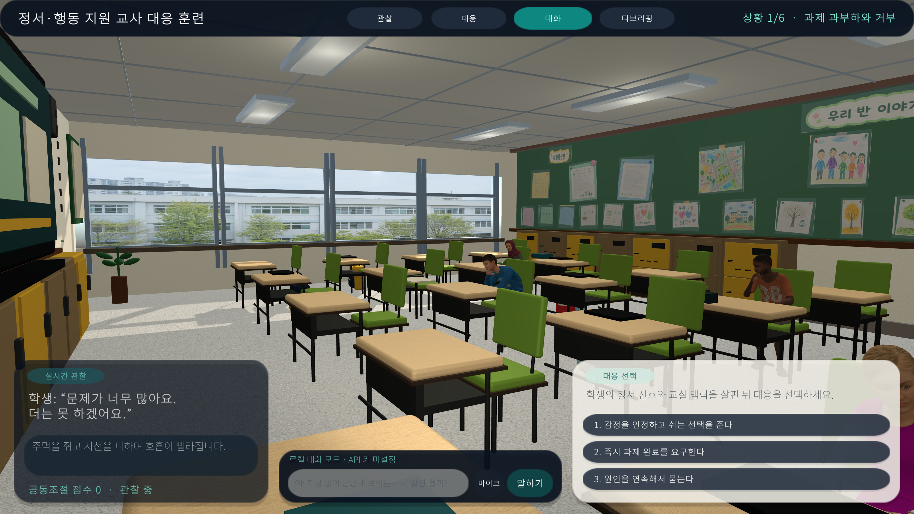

The general classroom scene is modeled around a contemporary Korean elementary classroom: front storage cabinets, desks and green chairs at elementary proportions, fluorescent ceiling lights, an electronic board, window views, backpacks, and a rear bulletin board assembled from individual poster, worksheet, notice, and student-art assets.

### Blender-authored Environment Upgrade

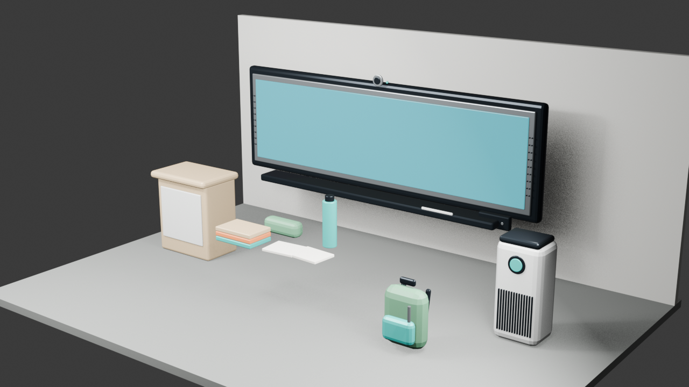

The environment upgrade keeps each asset reusable: a detailed electronic board, teacher podium, air purifier, desk props, and school backpack are authored as separate Blender meshes. Generated vinyl, birch-laminate, and painted-wall surfaces are connected through the procedural Unity builder. See [`Docs/VISUAL_UPGRADE_AUDIT.md`](Docs/VISUAL_UPGRADE_AUDIT.md) for the gap list and acceptance checks.

### Electronic-board PDF Presentation

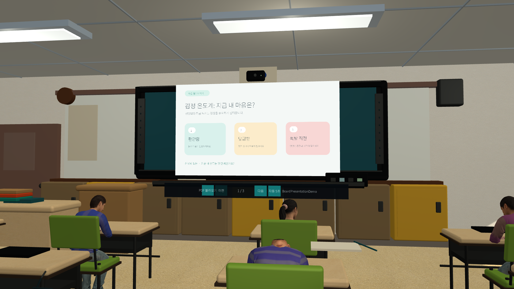

Teachers can import a local PDF into the in-world electronic board, navigate pages manually, or run a five-second slideshow. Rendering preserves the source aspect ratio and keeps only a bounded page cache. The active page text can inform both the student-response and teacher-rubric LLM prompts without uploading the PDF raster.

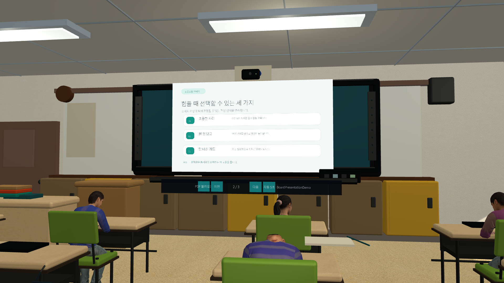

The built Windows player evidence loaded a real three-page Korean lesson PDF and transitioned from page 1 to page 2. Usage, privacy limits, plugin licensing, and the Meta Quest extension boundary are documented in [`Docs/PDF_PRESENTATION.md`](Docs/PDF_PRESENTATION.md).
### Face-to-Face Dialogue

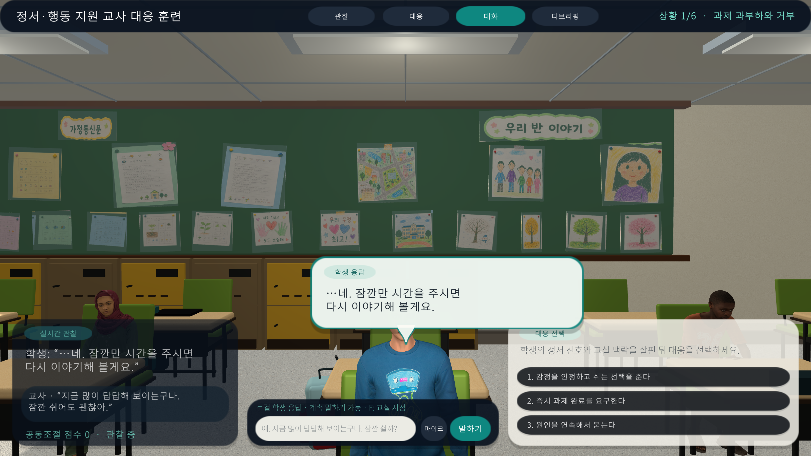

The focal student can be addressed directly from the teacher's viewpoint. The translucent speech bubble is anchored above the student's head and adjusted to avoid covering the face during eye contact. The lower HUD preserves the recent teacher utterance, student reply, and affect vector.

### Live Three-Turn OpenRouter Dialogue

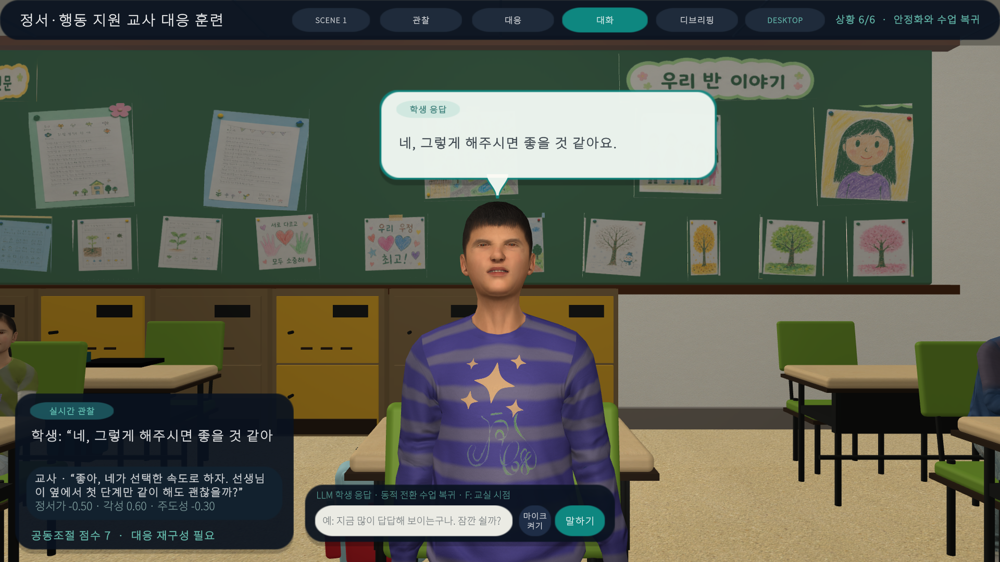

A Windows-player evidence run completed three consecutive teacher-student turns through OpenRouter (`openai/gpt-4o-mini`) with no deterministic fallback. Each turn preserves the conversation state, updates the student response/performance, and captures the head-anchored bubble and teacher HUD. The full transcript and screenshot index are in [`Assets/Reference/LLM_FreeDialogue_Evidence.md`](Assets/Reference/LLM_FreeDialogue_Evidence.md).

### Upright Eye Contact

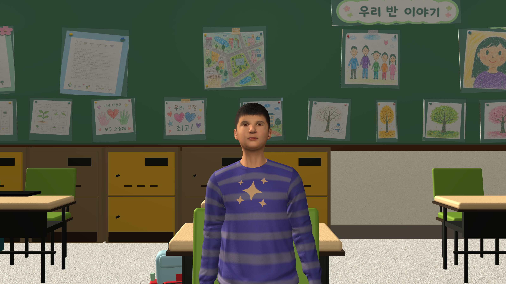

The face-to-face camera supports an upright posture and teacher-facing gaze. This is used for moments when the student has re-engaged enough to respond directly without looking down.

### Circle Discussion Scene

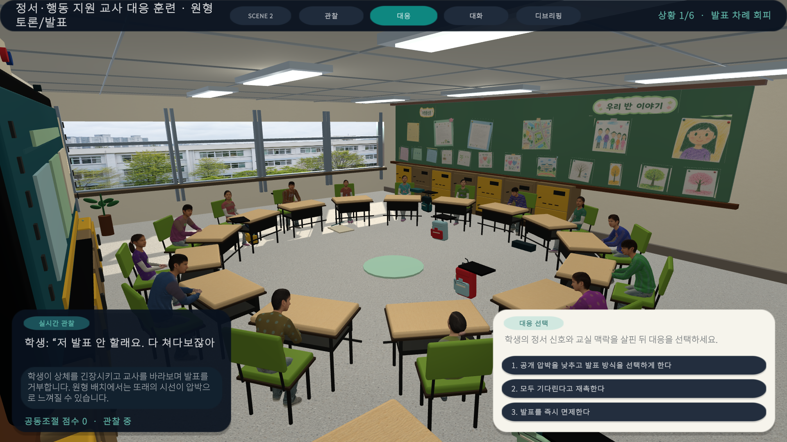

Scene 2 separates the same training system into a circle discussion and presentation arrangement. It focuses on peer attention pressure, public exposure, turn-taking conflict, leaving-seat attempts, private recontact, and supported return to a small speaking task.

### Scene 2 Eye Contact

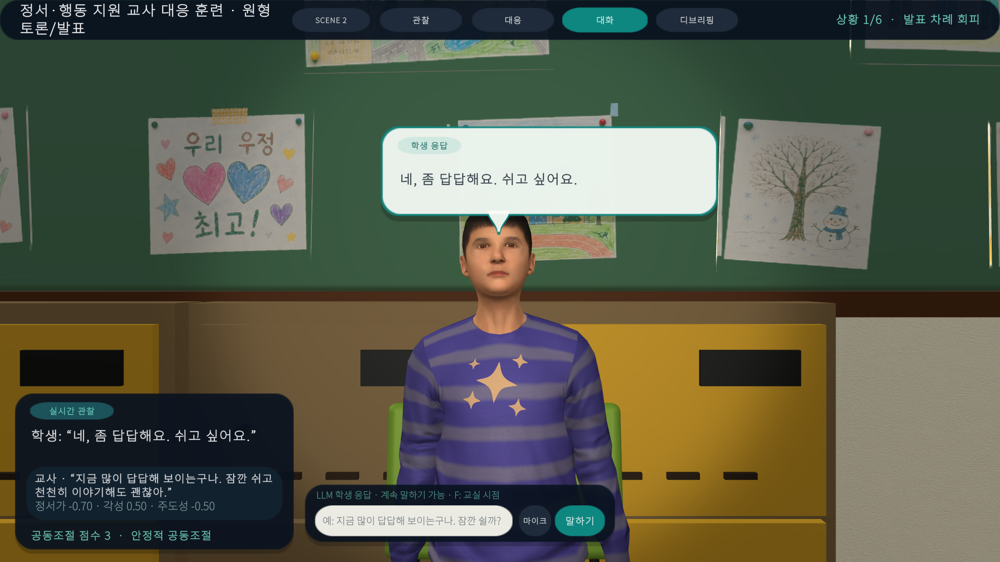

The circle scene uses the same direct-dialogue and speech-bubble system, allowing teacher response practice when the student is surrounded by classmates.

### Debrief

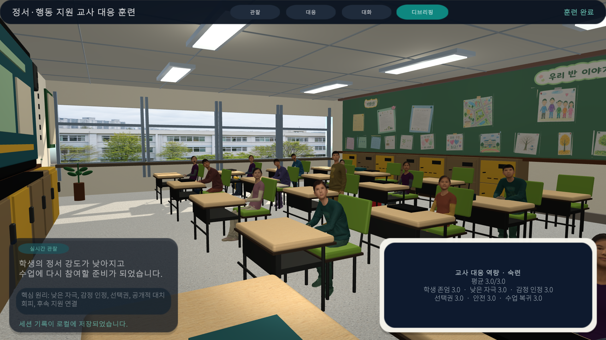

After the six-beat session, the simulation produces a local debrief and stores structured session records for later analysis.

## Research Purpose

The prototype is designed to help teachers practice co-regulation-oriented responses, not merely behavior control. It emphasizes reading emotional signals before, during, and after visible behavior, then choosing low-escalation language that preserves student dignity, safety, and agency.

The current training loop asks the teacher to:

- observe gaze, posture, breathing cues, facial expression, and hand movement;
- reduce public pressure and avoid unnecessary confrontation;
- validate emotion without endorsing unsafe behavior;
- offer constrained choices and a short regulation pathway;
- support a small return-to-learning step after stabilization;
- review how each response affects valence, arousal, dominance, gesture, gaze, and facial Action Units.

## Implemented Features

### Korean Elementary Classroom Environment

- Procedural scene builders for the general classroom and the circle discussion classroom.
- Realistic classroom components: electronic board, rear bulletin board, storage cabinets, windows, ceiling lights, student desks, chairs, teacher desk, floor and wall materials.
- Individual bulletin-board assets instead of one flattened background image.
- Slightly rotated and unevenly spaced drawings, notices, worksheets, and class-title signs to avoid an over-arranged look.
- Generated material assets for floor, wall, desk laminate, bulletin items, and exterior Korean school window backdrop.
- Hanging backpacks with pocket, panel, zipper, and scale variation.

### Student Avatars

- Microsoft Rocketbox child avatars configured as Humanoid characters.
- Fifteen students per scene with varied face textures, skin tone, hair material, clothing texture, fabric surface, and non-text graphic motifs.
- Gaze behavior that tracks the teacher with per-student probability and timing variation.
- A small number of students can look down or away while most students orient toward the teacher, matching the classroom management requirement.

### Emotion, Gesture, and Facial Control

- Continuous affect vector: valence `-1..1`, arousal `0..1`, dominance `-1..1`.
- Bounded affect transitions so one teacher utterance does not create unrealistic emotional jumps.
- Facial Action Unit mapping from normalized `0..1` values to Rocketbox blendshape weights.
- Supported AUs include `AU1`, `AU2`, `AU4`, `AU5`, `AU6`, `AU7`, `AU9`, `AU12`, `AU15`, `AU17`, `AU20`, `AU23`, `AU24`, `AU25`, `AU26`, and `AU45`.
- Gesture repertoire for avoid gaze, fidget, withdraw, protest, defiant posture, desk tapping, shielding, pointing, pushing away, listening, and recovering.
- Idle behaviors including listening, looking around, desk fidgeting, shoulder motion, chin resting, and yawning.
- Source-owned AU overrides so dialogue animation can control only the expression channels it owns and release them cleanly afterward.

### Teacher Interaction UI

- Four training modes: observation, response, dialogue, and debriefing.
- Rounded translucent HUD panels using TextMeshPro and Noto Sans KR SDF font assets.
- Structured multiple-choice response buttons with press/hover motion.
- Direct dialogue input with optional Windows DictationRecognizer microphone input.
- Subtle button feedback sound and classroom-footstep style movement audio.
- Scene selector for switching between the general classroom and the circle discussion scene.

### OpenRouter LLM Integration

The simulation can run fully without an API key through a deterministic local fallback. When configured, OpenRouter is used for direct student dialogue.

Environment variables:

```text
OPENROUTER_API_KEY=<your key>
OPENROUTER_ENDPOINT=https://openrouter.ai/api/v1/chat/completions
OPENROUTER_MODEL=openai/gpt-4o-mini
OPENROUTER_MAX_TOKENS=320
OPENROUTER_TEMPERATURE=0.25
OPENROUTER_PROMPT_VERSION=1
```

The LLM response is constrained to structured JSON:

```json
{
  "studentReply": "Yes. I think I need a short break.",
  "valence": -0.15,
  "arousal": 0.42,
  "dominance": -0.05,
  "gesture": "Recover",
  "actionUnits": {
    "au1": 0.12,
    "au2": 0.04,
    "au4": 0.0,
    "au5": 0.08,
    "au12": 0.08,
    "au25": 0.1
  }
}
```

Malformed, unsafe, or unavailable LLM responses route to local fallback instead of stopping the training session. API keys and raw LLM responses are not written to the session log.

## Training Scenes

### Scene 1: General Classroom Response

File: [`Assets/Scenes/KoreanClassroomTraining.unity`](Assets/Scenes/KoreanClassroomTraining.unity)

1. Task overload and refusal
2. Rising anger and desk tapping
3. Anxiety and overbreathing
4. After a peer conflict
5. Silence and withdrawal
6. Stabilization and return to class

The core response skills are emotion validation, low stimulation, safe distance, limited choices, private recontact, and small return-to-learning steps.

### Scene 2: Circle Discussion and Presentation Response

File: [`Assets/Scenes/KoreanClassroomCircleTraining.unity`](Assets/Scenes/KoreanClassroomCircleTraining.unity)

1. Avoiding a presentation turn
2. Peer interruption and ridicule
3. Pushing away materials and protesting
4. Attempting to leave the seat
5. Private recontact
6. Returning through a small presentation step

This scene adds peer gaze pressure, public exposure, turn-taking order, movement safety, and supported re-entry into the classroom activity.

The scenario source is stored as researcher-editable ScriptableObject assets under [`Assets/Resources/Training`](Assets/Resources/Training). [`TrainingScenarioLibrary.cs`](Assets/Scripts/Runtime/TrainingScenarioLibrary.cs) is now only the runtime loader. See the [scenario authoring guide](Docs/SCENARIO_AUTHORING.md) for creating or revising personas, triggers, crisis stages, and teacher goals without editing C#.

## Evidence-Centered Telemetry

The runtime separates raw text from research telemetry. Session events include:

- session, scenario, beat, and phase identifiers;
- teacher action source, such as choice or typed utterance;
- hashed and length-only text metadata instead of raw teacher/student text;
- pre/post affect state;
- gesture, gaze, trust, engagement, and target vector signals;
- scoring evidence and rubric dimensions;
- LLM route, model, prompt version, fallback state, and latency metadata when applicable.

Replay validation checks event sequence order and schema compatibility. This makes the prototype more useful for future learning analytics and evidence-centered design work while reducing unnecessary sensitive text retention.

## Architecture

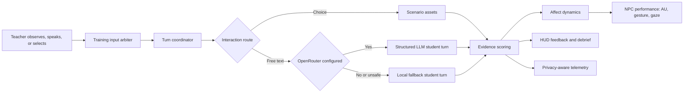

| Component | Responsibility |
|---|---|
| [`SimulationController.cs`](Assets/Scripts/Runtime/SimulationController.cs) | Session orchestration, response flow, direct dialogue, scoring, and logging |
| [`TrainingTurnCoordinator.cs`](Assets/Scripts/Runtime/TrainingTurnCoordinator.cs) | Shared state transitions for choice and free-text turns |
| [`TrainingInputArbiter.cs`](Assets/Scripts/Runtime/TrainingInputArbiter.cs) | Duplicate and stale input protection |
| [`TrainingSessionState.cs`](Assets/Scripts/Runtime/TrainingSessionState.cs) | Training phase and beat lifecycle |
| [`TrainingTelemetryModels.cs`](Assets/Scripts/Runtime/TrainingTelemetryModels.cs) | Research telemetry event schema |
| [`TrainingResearchCatalog.cs`](Assets/Scripts/Runtime/TrainingResearchCatalog.cs) | Persona and scenario metadata for research use |
| [`TrainingScenarioCatalog.cs`](Assets/Scripts/Runtime/TrainingScenarioCatalog.cs) | Resources catalog and scene-to-scenario lookup |
| [`TrainingScenarioAsset.cs`](Assets/Scripts/Runtime/TrainingScenarioAsset.cs) | Researcher-authored scenario sequence and runtime conversion |
| [`StudentPersonaAsset.cs`](Assets/Scripts/Runtime/StudentPersonaAsset.cs) | Reusable student strengths and support-needs profile |
| [`GenerativeAiCoach.cs`](Assets/Scripts/Runtime/GenerativeAiCoach.cs) | Desktop OpenRouter `ILlmGateway` and strict student/rubric requests |
| [`DialogueContracts.cs`](Assets/Scripts/Runtime/DialogueContracts.cs) | Typed student-turn, transition-signal, and six-dimension rubric contracts |
| [`ConversationSessionState.cs`](Assets/Scripts/Runtime/ConversationSessionState.cs) | Bounded transcript and accumulated relational state |
| [`ScenarioTransitionEngine.cs`](Assets/Scripts/Runtime/ScenarioTransitionEngine.cs) | Auditable signal-to-crisis-stage transition rules |
| [`SecureProxyLlmGateway.cs`](Assets/Scripts/Runtime/SecureProxyLlmGateway.cs) | Provider-key-free Quest/WebGL proxy client boundary |
| [`OpenRouterRuntimePolicy.cs`](Assets/Scripts/Runtime/OpenRouterRuntimePolicy.cs) | LLM runtime settings, safety policy, and structured output normalization |
| [`FacialActionUnitController.cs`](Assets/Scripts/Runtime/FacialActionUnitController.cs) | AU profile, explicit overrides, and Rocketbox blendshape mapping |
| [`NpcPerformance.cs`](Assets/Scripts/Runtime/NpcPerformance.cs) | Affect, gesture, animation, gaze, and procedural upper-body integration |
| [`TrainingHud.cs`](Assets/Scripts/Runtime/TrainingHud.cs) | Response UI, speech bubble, dialogue, and feedback panels |
| [`TrainingSceneSelector.cs`](Assets/Scripts/Runtime/TrainingSceneSelector.cs) | Scene 1 and Scene 2 switching |
| [`TrainingExperienceModeController.cs`](Assets/Scripts/Runtime/TrainingExperienceModeController.cs) | Desktop/IVR mode policy and OpenXR subsystem lifecycle |
| [`XrTeacherRigAdapter.cs`](Assets/Scripts/Runtime/XrTeacherRigAdapter.cs) | Transient XR Origin, tracked controllers, ray UI, and world-space HUD adaptation |

## Running the Project

1. Open the repository root in Unity Hub.
2. Use Unity `6000.4.9f1`.
3. Let the first import complete.
4. Open either training scene:
   - [`Assets/Scenes/KoreanClassroomTraining.unity`](Assets/Scenes/KoreanClassroomTraining.unity)
   - [`Assets/Scenes/KoreanClassroomCircleTraining.unity`](Assets/Scenes/KoreanClassroomCircleTraining.unity)
5. Press Play.

Controls:

| Input | Action |
|---|---|
| `W`, `A`, `S`, `D` | Move the teacher viewpoint |
| Right mouse button + move | Rotate classroom view |
| `F` | Toggle classroom view and face-to-face conversation focus |
| Response button | Select a teacher response and show feedback |
| `Enter` | Submit typed teacher dialogue |
| Microphone button | Toggle Windows dictation input |
| Top mode buttons | Switch observation, response, dialogue, and debrief views |

## Rebuilding Scenes

The scenes are generated by editor builders. If a change should persist, update the relevant builder instead of editing only the scene hierarchy.

Unity menu commands:

```text
Tools > Teacher Training > Build Korean Classroom
Tools > Teacher Training > Build Circle Discussion Scene
Tools > Teacher Training > Capture Classroom Preview
```

Main builders:

- [`KoreanClassroomBuilder.cs`](Assets/Editor/KoreanClassroomBuilder.cs)
- [`KoreanClassroomCircleBuilder.cs`](Assets/Editor/KoreanClassroomCircleBuilder.cs)
- [`KoreanClassroomBoardBuilder.cs`](Assets/Editor/KoreanClassroomBoardBuilder.cs)
- [`KoreanClassroomBulletinBuilder.cs`](Assets/Editor/KoreanClassroomBulletinBuilder.cs)
- [`KoreanClassroomBackpackBuilder.cs`](Assets/Editor/KoreanClassroomBackpackBuilder.cs)

## Validation

Final verification from the current development pass:

- EditMode tests: `67/67` passed.
- Rendered PlayMode QA: passed with nine current screenshots.
- Eye-contact alignment: `faceAxis=1.000`.
- Flow QA: six beats, four modes, verified buttons, six persistence records.
- Windows build: `WINDOWS_BUILD_OK`, output `Builds/TeacherResponseTrainingFinal/TeacherResponseTraining.exe`.
- Scene 2 built-player captures refreshed from the Windows player.

Commands:

```powershell
& 'C:\Program Files\Unity\Hub\Editor\6000.4.9f1\Editor\Unity.exe' `
  -batchmode -nographics `
  -projectPath '<repository-root>' `
  -runTests -testPlatform editmode `
  -testResults '<repository-root>\Logs\editmode-results.xml' `
  -logFile '<repository-root>\Logs\editmode.log'
```

```powershell
& 'C:\Program Files\Unity\Hub\Editor\6000.4.9f1\Editor\Unity.exe' `
  -batchmode -nographics -quit `
  -projectPath '<repository-root>' `
  -executeMethod AdieLab.TeacherTraining.Editor.KoreanClassroomBuilder.BuildWindowsFromCommandLine `
  -logFile '<repository-root>\Logs\windows-build.log'
```

Detailed QA notes are in [`Docs/VALIDATION.md`](Docs/VALIDATION.md).

## Repository Layout

```text
Assets/
├─ Art/                         # Classroom, UI, font, texture, and audio assets
├─ Editor/                      # Scene, mesh, material, QA, and build automation
├─ Generated/
│  ├─ StudentClothing/          # Fabric and graphic atlas textures
│  └─ StudentFaces/             # Generated student face textures
├─ Materials/                   # Classroom and student materials
├─ Meshes/                      # Generated desks, chairs, boards, backpacks, fixtures
├─ Reference/                   # Storyboards, QA screenshots, gameplay references
├─ Scenes/                      # Runtime training scenes
├─ Scripts/Runtime/             # Simulation runtime code
├─ Shaders/                     # Face and clothing shaders
├─ Tests/EditMode/              # Automated regression tests
└─ ThirdParty/MicrosoftRocketbox/
Docs/                           # Design, validation, asset, and alignment documentation
Documentation/                  # Detailed development roadmap
Packages/                       # Unity package manifest and lock file
ProjectSettings/                # Unity project settings
```

## Assets and License Notes

- Microsoft Rocketbox assets retain their MIT License notice in [`Assets/ThirdParty/MicrosoftRocketbox/LICENSE.md`](Assets/ThirdParty/MicrosoftRocketbox/LICENSE.md).
- `NotoSansKR-VF.ttf` retains the SIL Open Font License notice in [`Assets/Art/Fonts/OFL.txt`](Assets/Art/Fonts/OFL.txt).
- Generated classroom, clothing, and face textures are project-specific assets. The production rules are documented in [`Docs/IMAGEGEN_ASSET_PIPELINE.md`](Docs/IMAGEGEN_ASSET_PIPELINE.md).
- Real student records, unapproved source classroom photos, and API keys are not stored in the repository.
- `Library`, `Temp`, `Builds`, `Logs`, raw recordings, and local diagnostic frames are intentionally ignored.

## Known Limitations

- The current validated deployment target is Windows desktop. WebGL and VR are represented as constrained deployment paths rather than finished production builds.
- Direct student speech synthesis is not yet implemented.
- Windows dictation is available for teacher input, but a full Korean STT/TTS research pipeline remains future work.
- Rubric scores are authored research heuristics, not validated teacher evaluation instruments.
- Some Unity 6 obsolete API warnings remain around `FindObjectsByType` overloads; these do not block the current build or tests.

## Documentation

- [Korean README](README.ko.md)
- [`Docs/PROJECT_GUIDE.md`](Docs/PROJECT_GUIDE.md)
- [`Docs/SCENARIO_AUTHORING.md`](Docs/SCENARIO_AUTHORING.md)
- [`Docs/META_QUEST_READINESS.md`](Docs/META_QUEST_READINESS.md)
- [`Docs/SCENE_CONTRACT.md`](Docs/SCENE_CONTRACT.md)
- [`Docs/ACTION_UNIT_CONTROL.md`](Docs/ACTION_UNIT_CONTROL.md)
- [`Docs/IMAGEGEN_ASSET_PIPELINE.md`](Docs/IMAGEGEN_ASSET_PIPELINE.md)
- [`Docs/PROPOSAL_ALIGNMENT_AUDIT.md`](Docs/PROPOSAL_ALIGNMENT_AUDIT.md)
- [`Docs/VISUAL_IMPROVEMENTS.md`](Docs/VISUAL_IMPROVEMENTS.md)
- [`Docs/VALIDATION.md`](Docs/VALIDATION.md)
- [`Documentation/StudentSimulationDetailedRoadmap.md`](Documentation/StudentSimulationDetailedRoadmap.md)

## Contribution Rules

1. Scene changes that must persist should be reflected in the scene builders.
2. Preserve `.meta` files when adding or moving Unity assets.
3. Add focused regression tests for behavior contracts, parsing, scoring, and layout-sensitive UI changes.
4. Visual changes should include before/after screenshots with scene, resolution, and build context.
5. Do not commit API keys, real student data, or assets with unclear licensing.
6. Describe emotional and behavioral characteristics as observable training-context signals, not as diagnostic labels.

See [`CONTRIBUTING.md`](CONTRIBUTING.md) for more detail.
