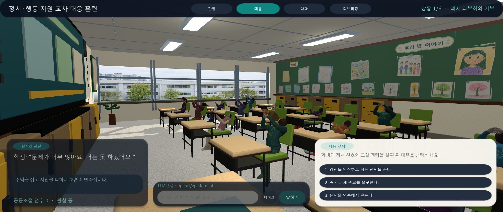
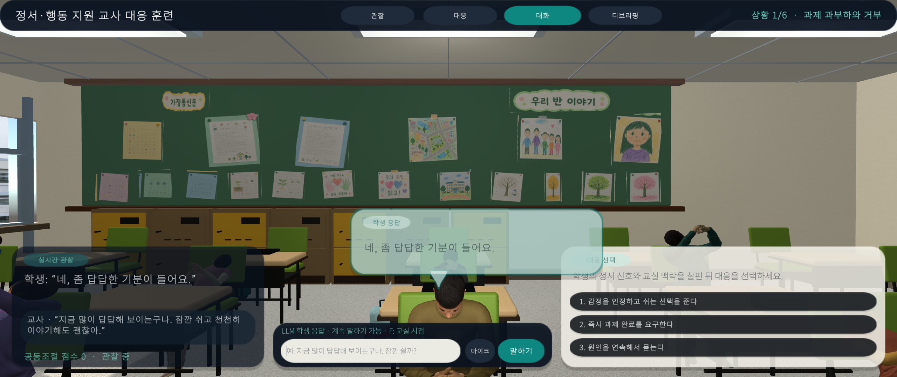
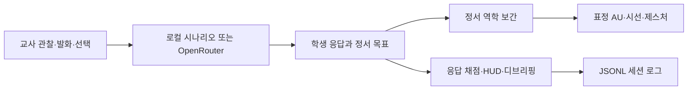

# 정서·행동위기 학생 대응 생성형 AI 교사대응훈련

한국 초등학교 교실에서 정서·행동 위기 신호를 보이는 학생에게 교사가 안전하고 관계 중심적으로 대응하는 방법을 연습하는 Unity 6 연구 프로토타입입니다. Microsoft Rocketbox 기반 학생 아바타, 한국 교실 환경, 직접 대화, 선택형 대응, 정서·행동 변화, 수행 피드백을 하나의 재현 가능한 시뮬레이션으로 구성했습니다.

> 현재 상태: 연구·개발용 프로토타입. 임상 진단, 실제 위기 대응 절차, 교원 자격 평가를 대체하지 않습니다.





## 주요 기능

- 일반 교실과 원형 토론·발표 교실의 두 개 훈련 씬
- Microsoft Rocketbox 기반 학생 15명과 한국 학생 외형에 맞춘 얼굴·의상 재질
- 학생별 시선 추적, 자연스러운 idle 행동, 문제행동 제스처, 표정 Action Unit 제어
- 정서가, 각성, 주도성, distress를 연속 보간하는 정서 역학
- 학생 정면 대화 시점, 머리 위 반투명 말풍선, 교사 발화 입력
- 단계별 선택지, 수행 기준 채점, 실시간 관찰 HUD, 디브리핑
- OpenRouter 기반 LLM 학생 대화와 연결 실패 시 로컬 결정론적 fallback
- JSON Lines 형식의 세션 로그

## 요구 환경

- Windows 11
- Unity `6000.4.9f1`
- Built-in Render Pipeline
- 선택 사항: OpenRouter API 접근

Unity Hub에서 저장소 루트를 열면 `Library`, `Temp`, `Logs`와 IDE 프로젝트 파일이 자동으로 재생성됩니다.

## 빠른 실행

1. `Assets/Scenes/KoreanClassroomTraining.unity`를 엽니다.
2. Play를 누르고 오른쪽 대응 선택지 또는 하단 직접 대화 입력창을 사용합니다.
3. WASD로 이동하고 마우스 오른쪽 버튼을 누른 채 시점을 회전합니다.
4. `F` 키로 교실 시점과 학생 정면 대화 시점을 전환합니다.

원형 발표 시나리오는 `Assets/Scenes/KoreanClassroomCircleTraining.unity`에서 실행합니다.

씬을 재생성하려면 Unity 메뉴에서 `Tools > Teacher Training > Build Korean Classroom`을 실행합니다. 생성된 씬의 객체, 재질, 배치 규칙은 `Assets/Editor/KoreanClassroomBuilder.cs`가 관리합니다.

## OpenRouter 설정

API 키는 프로젝트, 씬, 프리팹 또는 소스 코드에 저장하지 않습니다. Unity Editor나 빌드를 실행하기 전에 운영체제 환경변수로 설정합니다.

```text
OPENROUTER_API_KEY=<your key>
OPENROUTER_ENDPOINT=https://openrouter.ai/api/v1/chat/completions
OPENROUTER_MODEL=openai/gpt-4o-mini
```

`OPENROUTER_API_KEY`만 필수이며 endpoint와 model은 선택적 override입니다. 키가 없거나 요청이 실패해도 현재 세션을 중단하지 않고 로컬 대화 모델로 전환합니다. `.env.example`은 변수 이름을 안내하기 위한 템플릿이며 Unity가 자동으로 로드하지 않습니다.

## 훈련 데이터 흐름



## 검증과 빌드

2026-07-17 기준 메인 프로젝트를 Unity `6000.4.9f1`로 재생성했고 EditMode 테스트 `33/33`이 통과했습니다. 상세 검증 범위와 남은 시각 QA 항목은 `Docs/VALIDATION.md`에 기록합니다.

Windows 자동 빌드는 다음 entry point를 사용합니다.

```powershell
& 'C:\Program Files\Unity\Hub\Editor\6000.4.9f1\Editor\Unity.exe' `
  -batchmode -nographics -quit `
  -projectPath '<repository-root>' `
  -executeMethod AdieLab.TeacherTraining.Editor.KoreanClassroomBuilder.BuildWindowsFromCommandLine `
  -logFile '<repository-root>\Logs\windows-build.log'
```

빌드 산출물과 로컬 Unity 캐시는 Git에 포함하지 않습니다.

## 프로젝트 구조

| 경로 | 역할 |
|---|---|
| `Assets/Scenes` | 일반 교실·원형 토론 훈련 씬 |
| `Assets/Scripts/Runtime` | 대화, 정서, 애니메이션, UI, 평가, 로깅 |
| `Assets/Editor` | 교실·재질·씬 재생성 및 빌드 자동화 |
| `Assets/Tests/EditMode` | 행동 계약과 씬 구성 회귀 테스트 |
| `Assets/Generated` | 생성형 얼굴·의상 텍스처와 메타데이터 |
| `Assets/Art` | 교실, UI, 오디오 재질 |
| `Assets/ThirdParty/MicrosoftRocketbox` | Rocketbox 원본 에셋과 MIT 라이선스 |
| `Assets/Reference` | 선별된 스토리보드와 시각 QA 근거 |

## 문서

- `Docs/PROJECT_GUIDE.md`: 실행, 구성, 빌드, 개발 규칙
- `Docs/VALIDATION.md`: 자동·수동 검증과 현재 릴리스 체크리스트
- `Docs/ASSET_AND_LICENSE_GUIDE.md`: Rocketbox와 생성 에셋 정책
- `Docs/SCENE_CONTRACT.md`: 씬 구성 계약
- `Docs/ACTION_UNIT_CONTROL.md`: 표정 Action Unit과 제스처 제어
- `Docs/IMAGEGEN_ASSET_PIPELINE.md`: 생성 이미지 제작·검증 루프
- `Docs/PROPOSAL_ALIGNMENT_AUDIT.md`: 연구개발 목표 부합성 점검
- `Docs/VISUAL_IMPROVEMENTS.md`: UI, 말풍선, 아이컨택 개선 기록

## 라이선스와 보안

Microsoft Rocketbox 에셋은 포함된 MIT 라이선스를 따릅니다. 원문은 `Assets/ThirdParty/MicrosoftRocketbox/LICENSE.md`에 보존되어 있습니다. 생성 에셋과 참고 미디어의 사용 원칙은 `Docs/ASSET_AND_LICENSE_GUIDE.md`를 확인하세요.

API 키, 원본 학생 개인정보, 승인되지 않은 실제 교실 사진은 커밋하지 않습니다. 보안 민감 정보는 운영체제 환경변수와 로컬 전용 저장소에서만 관리합니다.

## 기여

재현 가능한 씬 빌더 변경, Unity `.meta` 보존, 테스트 근거, 시각 변경 전후 캡처를 기본 원칙으로 합니다. 자세한 기준은 `CONTRIBUTING.md`에 있습니다.
